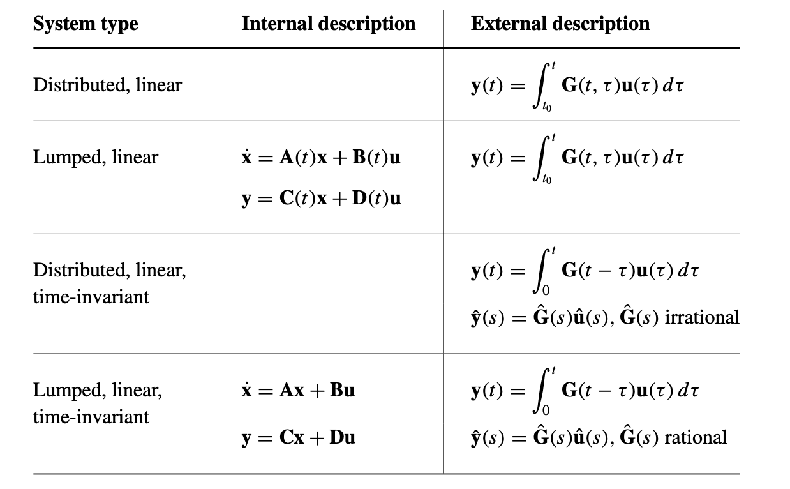

2021.9.20

[toc]

# Background

When I had nearly finished reaing *Feedback Control of Dynamic Systems*, I felt it not enough to know only SISO sytem features which is mainly covered by it. So I begin to read *Linear System Theroy and Design* and learn ODE. Hopefully this will make me more armed for my research.

​																																												——Bingchuan Wei

​	

# Chapter 1/Chapter 2/Chapter 3

Chapter 1 and 2 mainly clarifies some baisc concepts. Chapter 3 reviews linear algebra.

## Basic concepts

`states`: state is defined that if we know the state at $t_0$ , there is no more need to know the input **u**(t ) applied before  $t_0$in determining the output **y**(t) after  $t_0$. 
$$
\vec{x}(t_0) \quad and\quad \vec{u}(t)(t\geqslant t_0)
$$
totally defines a system from $t_0$

`Lumped system`: finite state variables

`transfer function`: is irrational for a distributive system and rantional for a lumped system(typically)

`proper`: A transfer function is proper when its denominator's order is no greater than nominator's, moreover, it's strict proper if less. 

`Real system`: real system is proper, but the reason is different for continous and discrete system. For continous, improper means a amplifier for high frequency, which is not expected and should be avoided. For discrete, improper means the system is not causal.

`blocking zero`: a zero of every entry of transfer matrix

When we hanve a MIMO system
$$
\hat{\bold{G}}(s) = \bold{C}(s\bold{I}-\bold{A})^{-1}\bold{B}+\bold{D}
$$
 

## Functions of matrix

### Polynomials of matrix

First we define two polynomials $f(x),g(x)$ *equal on the spectrum of A* if 
$$
f^{(l)}(\lambda_i) = g^{(l)}(\lambda_i) 
$$
where $\lambda_i$ is eigenvalues of A and $l$ is its algebric multiplicity.

What do we mean by equal on the sepctrum is that $f(A) = g(A)$, this feature can be used to caculate the polynomial of matrix.

### Functions of matrix

For a given $n\times n$ matrix A and a function f(x), we can get a polynomial h(x) with (n-1) degree based on the *spectrum equal*, and we define 
$$
f(A) = h(A)
$$

The other method to define the function of matrix is using taylor expansion, which requires all its eigenvalues in convergence radius. Using Jordan form, its not hard to prove two definitions are equivalent.  Exponential is commonly used. We need to notice: $e^{(A+B)t} \neq e^{At}e^{Bt}$ unless A B are commutative.

Using Laplace transformation and the derivative of matrix exponential, we get
$$
\mathcal{L}(e^{At}) = (sI-A)^{-1}
$$

 ## Lyapunov equation

We define operator $\mathcal{A}: M_{nm} \to M_{nm}, M \to AM+MB$ , then a lyapunov equation is 
$$
\mathcal{A}(M) = C
$$
The most important property of $\mathcal{A}$ is that its eigenvalue equal A's eigenvalue plus B's eigenvalue

## Norms of matrix

Most commonly used norms of matrix is induced norm, defined as 
$$
||A|| = \sup_{||x|| = 1}||Ax||
$$
Especially, when norms of x use p-norm :
$$
p = 1: ||A|| = \max_{j}\sum_i|a_{ij}| \\
p = 2: ||A|| = \max \sigma_i \\
p = \infty: ||A|| = \max_i \sum_j |a_{ij}|
$$

# Chapter 4

In *Feedback control of dynamic system*, we have seen how to get dynamic reponse from its internal and external description, here we will do it more generally.

## Solution on time domain and discretization

The solution for constant coefficient ODE is: 
$$
\vec{x} = e^{At}\vec{x}(0)+\int_0^te^{A(t-\tau)}B\vec{u}d\tau
$$
Define $\vec{x}[k] = \vec{x}[kT]$, and suppose $\vec{u}$ is a series $\vec{u}[k]$, than state equation can be discretized using the solution: 
$$
\vec{x}[k+1] = A_d\vec{x}[k]+B_d\vec{u}[k] \\
A_d = e^{AT} \quad B_d = \int_0^Te^{A\tau}d\tau B
$$

Attention, when we discretize a system, we don't use $\dot{x} = (x[(k+1)T]-x[kT])/T$, instead we use its solution and perform discretization.

## Equivalent state equation and Canonical Form

As we have seen in *Feedback control of dynamic system*, choicefor state variable is not unique, if we take a nonsingluar linear transformation to convert a state equation A to B, we say that A and B are **algebrically equivalent**. A weaker assertion is that if two system have the same transfer equation, then two systems are **zero-state equivalent**, which require [A B C D] and $[\bar{A} \quad \bar{B} \quad \bar{C} \quad \bar{D}]$
$$
D = \bar{D} \\
CA^mB = \bar{C}\bar{A}^m\bar{B},m=0,1,2,...
$$
For some transformation, the state equation is converted to specials forms that are called canonical forms.

## Realization

Given $\hat{G}(s)$, find its state equation is called system realization, obviously there are conditions for realizability. We assert

> (Thm)  $\hat{G}(x)$ is realizable if and only if  $\hat{G}(s)$ is a proper rational matrix.

Proof: Divide the $\hat{G}(s) = \hat{G}_{sp}+\hat{G}(\infty)$, 

If realizable, use $A^{-1} = \frac{A^*}{|A|}$, it's easy to show $\hat{G}(s)$ is proper. Conversely, can check the following is a kind of realization.
$$
\hat{G}(s) = \hat{G}_{sp}(s)+\hat{G}(\infty) \\
\hat{G}_{sp}(s) = \frac{1}{d(x)}\bold{N}(s)=\frac{1}{d(s)}(\bold{N_1}s^{r-1}+\cdots+\bold{N_r}) \\
d(s) = s^r+\alpha_1s^{r-1}+\cdots+\alpha_r \\
Choose \quad \bold{A} = \begin{pmatrix}
-\alpha_1\bold{I_p} & -\alpha_2\bold{I_p} & \cdots &-\alpha_{r-1}\bold{I_p}&-\alpha_r\bold{I_p} \\
\bold{I_p} & \bold{0} & \cdots & \bold{0} & \bold{0}\\
\bold{0} & \bold{I_p} &  \bold{0} & \cdots & \bold{0} \\
\vdots & \vdots & \vdots & \vdots & \vdots & \\
\bold{0} & \bold{0} & \cdots &\bold{I_p}& \bold{0} 
\end{pmatrix} \\
\bold{B} = \begin{pmatrix}
\bold{I_p} \\
\bold{0} \\
\vdots \\
\bold{0}
\end{pmatrix} \\
\bold{C} = [\bold{N_1} \quad \bold{N_2} \quad\cdots\quad \bold{N_r}] \quad \bold{D} = \hat{G(\infty)}
$$
Actually the realization is connected with **Control cononical form**

Attention this realization is not unique. For control cononical form, 

## Solution to LTV system

It seems that a LTV system state equation is just a first-order linear equation and can be easily solved by constatne variation. However, due to the commutative property not hold for matrix multiplication, the solution is actually not right via constant variation.

The key to this question is **fundamental matrix** $\bold{X(t)}$consists of n linear independent solution of zero-input state equation. Then we define **state transition matrix** as
$$
\Phi(t,t_0) = \bold{X}(t)\bold{X}^{-1}(t_0)
$$
Then we can validate that the solution to LTV system is 
$$
\bold{x}(t) = \Phi(t,t_0)\bold{x_0}+\int_{t_0}^{t}\Phi(t,\tau)B(\tau)u(\tau)d\tau \\
\bold{G}(t,\tau) = C(t)X(t)X^{-1}(\tau)B(\tau)+D(t)\var(t-\tau)
$$
The state transition matrix governs the unforced propagation of the state vector. 

## Equivalence of LTV system

We define algebrecally equivalent the same way as we did in LTI system. However, they have distinct properties.

Under equivalent transformation $\bar{\bold{x}} =P\bold{x}$, fundamental matrix satisfies $\bar{\bold{X}} =P\bold{X}$, we can prove that a system can be equivalent to a system with any constant $A$, even for zero! Since this sort of equivalence destroys the information in A, we need to find a susbsitute equivalence for LTV system.

### Lyapunov Equivalence

If we require the P and its inverse must be continuous and bounded for all t, the transformation is called **Lyapunov transformation**, based on which we establish Lyapunov equivalence. It's not possible for us to transform every system to constant A, but we can still do that for perodic system.

## LTV system realization

A LTV system is realizable if and only if its transfer function can be be descomposed as 
$$
\bold{G}(t,\tau) = M(t)N(\tau)+D(t)\var(t-\tau),t\geqslant\tau
$$
A simple realization is
$$
A = 0 \quad B=N(t) \quad C = M(t) \quad D = D(t)
$$

# Chapter 5

More on stablity for LTI and LTV system. 

Stablity can be classified for external stablitiy(zero state) and internal stablity(zero input). 

## Zero state stablity(BIBO) for LTI system

Using adjacent matrix to express inverse in transfer function, we can get that the poles of transfer function is a subset of A's eigenvalues.

Rules for SISO system can be easily generilized for MIMO system:

>A multivariable system with impulse response matrix $G(t ) = [g_{ij} (t )]$ is BIBO stable if and only if every $g_{ij}(t)$ is absolutely integrable in [0, ∞).
>
>A multivariable system with proper rational transfer matrix $\hat{G} (s) = [g_{ij} (s)]$ is BIBO stable if and only if every pole of every $g_{ij} (s)$ has a negative real part.
>
>A nessassary condition for a system to be BIBO stable is real part of eigenvalues of A are in left hafl plane

For discrete system, the above conclusions are true except LHP should be changed to unit circle.

## Zero input stablity for LTI system

For a linear system, we define **marginally stable**(or Lyapunov stable): a finite inital state excites a bounded response. **asymptotically stable**: the bounded response converges to 0.

We know that Lyapnov stable is defined for linear and non-linear system, but we only discuss linear situation here

>The equation **x** ̇ = **Ax** is marginally stable if and only if all eigenvalues of **A** have zero or negative real parts and those with zero real parts are simple roots of the minimal polynomial of **A**.
>
>The equation **x** ̇ = **Ax** is asymptotically stable if and only if all eigenvalues of **A** have negative reaparts.

LTV system is hard to analyze.

# Chapter 6

Chapter 6 discusses controllablity and observability

Briefly speaking, controllability deals with whether or not the state of a state-space equation can be controlled from the input, and observability deals with whether or not the initial state can be observed from the output.  We mainly discuss LTI system. **Controllability and observablity are defined under the condition that the state equation, namely A, B, C ,D are totally known**. That distinguishes them from the problem of realization and identification.

## Controllability

In *Feedback control of dynmaic system*, we see that controlablity is defined as the possiblity of transferring system to control cacnonical form. Here we give it another definition for system $\bold{\dot{x}} = A\bold{x}+B\bold{u} $:

>*The state equation or the pair* (**A**, **B**) *is said to be* controllable *if for any initial state* $x(0) =x_0$ and any final state $x_1$, there exists an input that transfers $x_0$ to$ x_1$ *in a finite time.* 

We then prove two definitions are exactly equivalent, actually we have TFAE:[Equivalent conditions for controllablity](https://en.wikipedia.org/wiki/Controllability_Gramian)

For LTI system ,we can get exactly what input we need using controll Gramian

We can see more details in the structure of B and controllability matrix: 

>Linearly dependent columns means input redundancy.

Since controllablity matrix can be written as 
$$
\mathcal{C}=\begin{pmatrix}
b_1 &\cdots &b_p|Ab_1 &\cdots &Ab_p|\cdots|A^{n}b_1 &\cdots &A^{n}b_p
\end{pmatrix}
$$
We suppose B to be full rank(without loss of generality), then for each $b_i$, there exists a maximum $\mu_i$ ,s.t. $b_i,...,A^{\mu_i}b_i$ are linearly independent, we call ${\mu_1,...,\mu_n}$ are controllability indices, its maximum is called **controllablity index**.

 The set of the controllability indices are invariant under any equivalence transfor- mation and any rearrangement of the inputs.

## Observability

Here we know the exact definition of the observability

>The state equation  is said to be observable if for any unknown initial state **x**(0)*, there exists a finite* $t_1$ > 0 such that the knowledge of the input **u** *and the output* **y** *over* $[0, t_1]$ *suffices to determine uniquely the initial state* **x**(0)*.* 

In *Feedback control of dynmaic system*, we see that there is a duality for controllablity and observability. We put it clear here:

>The pair (**A**, **B**) is controllable if and only if the pair $(A^T, B^T)$ is observable.

Using the duality, we get TFAE:[Equivalent conditions for observability](https://en.wikipedia.org/wiki/Observability_Gramian)

Similarly we can define observability indices, its maximum is called **observability index**.

## Canonical Decomposition

Uncontrollable always means a subsystem is not connected to our input and canonical decomposition is to express this clearly. 

Attention equivalence transformation is actually a zero-state equivalence. 

Just like uncontrollability means that a subsystem is not connected to input, unobservability means that a subsystem is not connected to output. Combine decomposition for two matrices, we get **Kalman decomposition**

Kalman decomposition tells us an important fact that information contains are different. For a chosen system, transfer function only gives the information that the part both connected to input and output.

An advantage for using Jordan form is that the condition for controllablity and observability can be experessed using B and C. 

# Interesting Problem

## Chapter 2

2.4 Trunction operator

